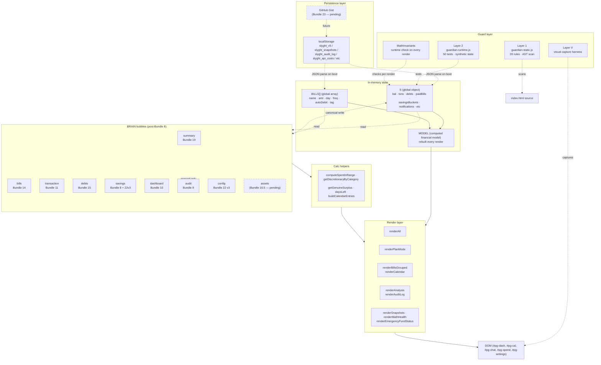

# SLYGHT — Architecture Overview

> Living document. Last revamp: 2026-05-12 post-Bundle-22-v3 (Settings IA refactor complete).
> Maintainer: keep in sync as bubbles shift / canonical writers move.
> John uses this as a software-consultant mental model of his own app.

## 1. What slyght is

A single-file mobile-first PWA for John's daily financial visibility. All state lives in `localStorage` on his device; there's no backend. The app loads from GitHub Pages, registers a service worker for offline + push, and renders ~7 tabs (Dashboard / Bills / Chat / Analysis / Settings) plus PLAN mode as a slide-over.

Source of truth: `index.html` (one file, ~14,500 lines). Service worker (`sw.js`), state fixture (`state-snapshot.json`), capture helper (`capture-state.js`), Layer V harness (`scripts/layerV-capture.js`), test guardians (`guardian-*.js`) round it out.

## 2. Layer diagram



## 3. State Layer

### localStorage keys (persistence)

| Key | Owner | Purpose |
|---|---|---|
| `slyght_v5` | core | The everything blob: `{S, BILLS}` JSON. Mutated by `save()`. Read by `load()` at boot. |
| `slyght_snapshots` | SNAPSHOTS module | Tiered snapshot history (Bundle 21). Up to ~250 entries. |
| `slyght_audit_log` | AUDITOR | Append-only event log (max 100 entries) |
| `slyght_api_costs` | API_COSTS | Anthropic API call costs |
| `slyght_ux_report` | UX | Tap tracking + missed-tap reports |
| `slyght_api_key` | (security-sensitive) | Anthropic API key (stripped on export) |
| `slyght_seeded_v15..v22` | seeds | One-shot migration flags |
| `slyght_lastEODCheck` | HEARTBEAT (Bundle 17.y) | Date string of last end-of-day check (prevents reload-churn) |
| `slyght_last_cat` | Quick Log | Last-used category for fast re-log |
| `slyght_last_export` | export | Timestamp of last clipboard export |
| `slyght_payday_plan` | PLAN | User's locked payday allocations |
| `slyght_dismissedNotifications` | NOTIFY | IDs the user x'd out |
| `slyght_subscription` | PUSH | Web push subscription |

### In-memory globals

| Global | Shape | Mutability |
|---|---|---|
| `S` | `{bal, txns[], debts[], paidBills{}, savingsBuckets[], notifications[], …}` | Mutated by canonical writers + save() |
| `BILLS` | `[{name, amt, day, freq, autoDebit, tag, recurring}]` | Mutated by saveBill / seedV* migrations |
| `MODEL` | `{daysToPayday, cycleSpent, weekSpent, todaySpend, billsThisMonth, calendarEntries, …}` | Rebuilt fresh on every render via `computeFinancialModel()` |
| `_planScrollSavedY` | number (scroll px) | Bundle 16.6 — captured by PLAN_MODAL.open, restored by close |
| `MathInvariants.invariants[]` | rule registry | Constant array |

## 4. BRAIN layer (8 bubbles after Bundle 22 v3)

Each bubble is a sub-object on `BRAIN` (defined at index.html L11284). Cross-cutting bubbles act as canonical writers/readers for state. Tab bubbles own their UI tab's read/write surface. **Bundle 22 v3** added `BRAIN.config` (income / payday / budgets / round-ups-enabled) and extended `BRAIN.savings` with round-up destination + read helpers — every Settings edit now flows through a canonical writer with audit logging and typed source-tag validation.

### Cross-cutting (shared services)

| Bubble | Bundle | Methods | Owns |
|---|---|---|---|
| `BRAIN.audit` | 8 | `append(entry)` · `recent(n)` | Append-only event log — every canonical writer logs source tag |
| `BRAIN.config` | **22 v3** | `setIncome` · `setPayday` · `setWeekdayBudget` · `setWeekendBudget` · `setRoundUpsEnabled` | Single source for income / payday / budgets / round-ups on-off. Replaced 5+ direct `S.x = ...` write sites |
| `BRAIN.savings` | 8 + 22 v3 | `setBucketSaved` · `addToBucket` · `getBuckets` · `getBucket(nameOrId)` · `getRoundUpDestinationName` · `setRoundUpDestination(target, src)` | Buckets + round-up destination. Resolver routes name → bucket OR PLAN trip/goal id |
| `BRAIN.summary` | 19 | `total(range)` · `byCategory(range)` · `totalsByCategory(range)` · `todayTxns(now)` · `aiContext()` | Precomputed rollups + AI envelope. Delegates to canonical filter helpers. |

### Tab bubbles

| Bubble | Bundle | Methods | Tab |
|---|---|---|---|
| `BRAIN.dashboard` | 10 | `todaySpend(now)` · `todayTxns(now)` · `cycleSpend()` · `weekSpend()` | Dashboard "NOW screen" |
| `BRAIN.transaction` | 11 | `record(txn, src)` · `recordCorrection(diff, reason)` · `removeByTs(ts)` · `findByTs(ts)` · `list(predicate)` | Quick Log + txn list. `recordCorrection` is the Bundle 15.1 wrapper used by balance reconciliation |
| `BRAIN.bills` | 14 | `markPaid(bill, src, opts)` · `unmark(key, src)` · `setPendingPay()` · `consumePendingPay()` · `isPaid()` · `isAutoDebit()` · `autoMatch()` · `autoDetect()` · `dueBeforePayday()` | Bills tab + paid/unpaid lifecycle |
| `BRAIN.debts` | 15 + 22 v3 | `add` · `markPaid` · `unmark` · `update` · `delete` · `setStrategy` · `findById` · `active` · `total` · `isViaRent` · `allocateWrxProceeds` | Debts + WRX sale + strategy. `setStrategy` added 22 v3 (snowball/avalanche) |

### Source tag vocabulary (BRAIN.SOURCES)

Frozen enum. Every canonical writer takes a `source` arg validated against `_SOURCE_SET`. Pre-Bundle-11 these were stringly-typed — Bundle 11 froze the vocabulary. Bundle 22 v3 added 7 new tags for Settings paths.

```
Bundle 8–15 baseline:
  ROUNDUP · UNDO_ROUNDUP · PLAN_ADD · PLAN_EDIT · MANUAL · RECONCILE · MIGRATION · CHAT
  LOG_EXPENSE · LOG_INCOME · LOG_FROM_PERSON · PAY_BILL_NOW · MARK_BILL_PAID · BUCKET_QUICK_ADD
  UNMARK_BILL · AUTO_MATCH · AUTO_DETECT · ADD_DEBT · CLEAR_DEBT · UNMARK_DEBT · UPDATE_DEBT
  DELETE_DEBT · WRX_ALLOCATE · RECONCILE_CORRECTION

Bundle 22 v3 additions:
  SETTINGS_INCOME_EDIT · SETTINGS_PAYDAY_EDIT · SETTINGS_BUDGET_EDIT
  SETTINGS_DEBT_STRATEGY · SETTINGS_ROUNDUP_DEST · SETTINGS_ROUNDUPS_TOGGLE
  QUICKLOG_ROUNDUP_DEST (reserved)
```

## 5. Calc layer — canonical helpers

Pure functions. No state mutation. Single source of truth per metric.

| Helper | What | Used by |
|---|---|---|
| `_NON_SPEND_CATS` (Set) | Categories that don't count as discretionary spend | All filter helpers |
| `computeSpentInRange(from, to)` | Total discretionary spend in [from, to) | BRAIN.summary.total |
| `getDiscretionaryByCategory(from, to)` | Group-by-category in range | BRAIN.summary.byCategory |
| `computeSpentToday(now)` | Today's discretionary spend | BRAIN.dashboard.todaySpend |
| `todayTxnsCanonical(now)` | Today's discretionary txn list | BRAIN.dashboard.todayTxns |
| `computeFinancialModel()` | Rebuilds MODEL — single pass over S+BILLS yielding every render-time number | renderAll |
| `getGenuineSurplus()` | Balance-based "what's truly free after buffer" | Hero card · Monthly Position legacy callers |
| `getActiveDebtsDueBeforePayday()` | Debt sum due in current cycle | renderDebtTiles · Monthly Position |
| `daysLeft()` | Days until next payday | MODEL.daysToPayday seed |
| `buildCalendarEntries()` | Per-day map of bill+debt items, freq-aware | renderCalendar |
| `isBillDueThisMonth(b)` | Freq-aware "should this render this month" | renderBillsGrouped · projection |
| `getThisWeekProjection()` | Week-projection tile math | renderCalWeekSummary |

## 6. Render layer

| Entry point | Fires on | What it does |
|---|---|---|
| `renderAll()` | Every onStateChange | Rebuilds MODEL + all visible tabs in sequence |
| `renderPlanMode()` | PLAN open + every confirm | Net Worth, WRX card, payday allocation, trips, goals, super, provisions, income sim |
| `renderCalendar()` | Bills tab visible + month change | 6×7 day grid with paid/unpaid/debt markers |
| `renderBillsGrouped()` | Bills tab visible | This Week + Monthly Bills groups (Bundle 17 payday-aware projection) |
| `renderDebtTiles()` | Dashboard | Immediate Debts tile + per-debt cards |
| `renderDashTxns()` | Dashboard | Recent Spending list |
| `renderSurvivalBanner()` | Dashboard + onBalanceChange | Critical / Survival / Tight / Cautious banner |
| `renderMonthlyPosition()` | Dashboard | Cash-flow summary (Bundle 17.y monthly-equivalents) |
| `renderEmergencyFundStatus()` | Settings | Now: redirect to PLAN Freedom Buffer (Bundle 17.y) |
| `renderSnapshots()` | Settings | Tiered snapshot list with pin + restore buttons (Bundle 21) |
| `renderAuditLog()` | Settings → Diagnostics | Activity log entries |
| `renderMathHealth()` | Settings → Diagnostics | MathInvariants pass/fail summary |
| `renderTrend()` · `renderCatBreakdown()` | Analysis tab | (Note 8: still uses raw S.txns.filter — pending migration) |

### PLAN_MODAL (modal infrastructure)

Defined at L14393. Universal modal opener for PLAN-mode dialogs. Bundle 16.6 centralized scroll-restore here — every Cancel / X / Save / Got It exit routes through `PLAN_MODAL.close()` which restores from `_planScrollSavedY` saved at `open()`.

## 7. Cross-cutting modules (non-BRAIN)

These predate BRAIN and may get folded into bubbles in future bundles. They sit as free-floating constants.

| Module | Owns | Notes |
|---|---|---|
| `SNAPSHOTS` | State backup/restore | Bundle 21 tiered eviction. ~250 cap. Pin to keep forever. |
| `MathInvariants` | Runtime safety net | Each render checks 13 invariants (paidbills shape, key-not-future, etc) |
| `AUDITOR` | Anomaly log | Logs JS errors, balance discrepancies, consistency fails |
| `RECONCILER` | Daily reconciliation | Compares yesterday's snap to today's bal — flags drift |
| `CONSISTENCY` | Periodic checks | Heartbeat fires consistency probes every 2 min |
| `HEALTH` | Data health scan | Surface bad debts (no priority, etc) — visible in Diagnostics |
| `APP_HEALTH` | Banner manager | Health banner show/hide |
| `UX` | Tap tracking | Records interactions, missed taps, slow renders |
| `NOTIFY` | In-app notifications | Bell badge + drawer + Smart Notifications schedule |
| `PUSH` | Web push | Service-worker-backed push notifications (worker URL: slyght-worker.johndounas.workers.dev) |
| `CHARACTER` | Spending discipline scoring | Analysis tab character score |
| `API_COSTS` | Anthropic API tracking | $X/month spend display |
| `SLYGHT_SCORE` | Overall composite score | 5-dimension scoring |
| `HEARTBEAT` | 2-min interval | Drives EOD checks + consistency probes |
| `PLAN` | Future-plan engine | Trips, goals, provisions, WRX sale projections |
| `PLAN_MODAL` | Modal helper | open/close/btn helpers for PLAN-mode modals |

## 8. Guard layer

### Layer 1 — guardian-static (AST scan)

Runs on every `npm test`. Parses index.html with Acorn + walks the AST. 20 active rules + 38-entry allow-list.

Examples:
- `no-direct-paidbills-access` — every read/write must go through `isPaidBillKeyTruthy()` or `BRAIN.bills.unmark()`
- `no-direct-debts-mutation` — `S.debts = ...` reassignment must route through BRAIN.debts
- `no-hardcoded-bill-name` — render code must not string-compare bill names
- `no-inline-daysleft-outside-canonical` — use `MODEL.daysToPayday`, not raw `daysLeft()`
- `no-third-discretionary-filter-array` — don't create yet another discretionary-cat list
- `state-shape-paidbills` — paidBills values must be `true` or `{paid:true, ...}` (no garbage)

Allow-list rules require explicit justification per occurrence. Migrations (seedV*) wrapped with `guardian-allow-block-start/end` comments naming the rule + reason + when the allow can be removed.

### Layer 2 — guardian-runtime (50 synthetic-state tests)

Bootstraps a synthetic `TEST_S` + `TEST_BILLS`, then exercises behavior. Sections: balance integrity, debt verification, bills state, surplus/max-day, spending calcs, net worth, data integrity, mock go-live scenarios, dynamic calculations, new systems runtime checks.

Bundle 22.1 cleaned 6 outdated tests so future regressions surface immediately instead of getting buried.

### Layer 3 — MathInvariants (runtime checks)

13 invariants. Fires on every render. Examples:
- `paidbills-key-not-future` (MI-13) — keys with future days must carry `_scheduledAutoDebit: true`
- `state-shape-paidbills` — every value is `true` or `{paid:true, ...}`
- `bal-matches-txns` — `S.bal` reconciles with txn ledger

Counts per invariant tracked in `S._invariantViolationCounts`. Banner fires at L3245+ when one trips.

### Layer V — visual capture harness

`scripts/layerV-capture.js` — Playwright captures 37 surfaces against fixture state. Compare-to-phone-screenshots is the truth source for "does it look right." Bundle 16.5 added CLI args + harness path fixes.

### Layer I — interaction layer (specced, not built)

`MISSION-INTERACTION-LAYER.md` describes a future AI-agent-walks-the-app loop. Not implemented yet.

## 9. Data-flow walkthrough — "user logs a $5 coffee"

```
User taps + (FAB) → openQuickLogModal()
  ↓ modal renders, defaults to last-used category
User types $5 + "Latte" + taps Log It → quickLogSubmit()
  ↓
  validates amount + day if recurring
  ↓
  S.bal -= 5  (mutated directly — known exception)
  ↓
  BRAIN.transaction.record({amt:5, note:"Latte", cat:"Food / Coffee", income:false},
                           BRAIN.SOURCES.LOG_EXPENSE)
    → validates source against BRAIN._SOURCE_SET
    → pushes to S.txns with ts:Date.now()
    → BRAIN.audit.append({type:'txn_record', amt:5, src:LOG_EXPENSE, ts})
    → save() → localStorage.setItem('slyght_v5', JSON.stringify({S, BILLS}))
  ↓
  Maybe BRAIN.savings.addToBucket('China Holiday', 0.40, BRAIN.SOURCES.ROUNDUP)
    if round-ups enabled
  ↓
  onStateChange('txn-add')
    → save() again (defensive)
    → detectPaydayCycleRollover()
    → autoDetectBillPayments() — wraps BRAIN.bills.autoDetect()
    → checkDayBudgetAlert() — NOTIFY.add if over budget
    → CHARACTER.analyseTransactions()
    → renderAll()
        → computeFinancialModel() — rebuilds MODEL
        → renderAlerts / renderMonthlyPosition / renderDebtTiles / renderDashTxns
        → if Bills tab visible: renderBillsGrouped + renderCalendar
        → MathInvariants check (Layer 3)
    → SNAPSHOTS.autoSnapshot('transaction')
        → take() unshifts to top of slyght_snapshots
        → save() runs _evict() per Bundle 21 tier rules
```

The flow has ~20 side-effect steps per Quick Log. Most are defensive (multiple save() calls, double-fire of guards). Refactor opportunity in Bundle 24+.

## 10. Bottlenecks

### Performance

1. **Every render does full S.txns scans.** 10+ inline `S.txns.filter(...)` sites bypass BRAIN.summary. At 130 txns OK; at 1,000+ noticeable; at 10,000+ janky. **Bundle 19 added the foundation; migration pending (Note 7).**

2. **renderAll rewrites every tab's innerHTML.** No targeted DOM patch — full re-render of bills list, calendar, debt tiles, etc. on every state change. Browsers re-layout entirely.

3. **MODEL rebuilt every render via computeFinancialModel().** Single pass over S + BILLS. At current scale fine; at 1000+ txns noticeable. Memoization candidate.

4. **JSON.parse + JSON.stringify on every save().** localStorage forces serialize roundtrip. SNAPSHOTS.take() serializes the entire state too. ~150KB current, scaling linearly with txns + snapshots.

5. **Snapshot list re-rendered on every Settings render.** ~250 snapshots × DOM nodes adds up. Virtualization candidate (Bundle 22.5+).

### Correctness gaps

1. **autoDetect doesn't check txn month vs bill month** (Note 6). Could re-create the YouTube/Spotify auto-flag treadmill killed in Bundle 7.2.3. Same bug class.

2. **RECONCILER + chat-context paths use raw S.txns.filter** (Note 7). Bundle 19's BRAIN.summary unused on these surfaces — divergence potential.

3. **Analysis tab consumers (renderTrend, renderCatBreakdown) use overly-broad discretionary filter** (Note 8, OPEN-BUGS #6).

4. **renderTrend NW Trend math fixed** (Bundle 17 sanity-clamp) but underlying issue (monthlyHistory schema captures only `bal` not full NW shape) remains.

5. **PLAN_MODAL scroll-restore edge cases** (Note 14). Bundle 16.6 centralization works for common flows; needs stress test for race conditions.

### Architectural

1. **No targeted DOM updates.** Pattern is rip-and-replace innerHTML. Vue/React would help but full rewrite cost too high.

2. **PLAN module is heavyweight + free-floating.** Not yet a BRAIN bubble. Folds into BRAIN.dashboard or BRAIN.plan when bubble lands (Bundle 18+).

3. **No real plan-vs-actual variance tracking.** PLAN's "locked plan" is decoration — nothing measures spending against the plan (Bundle 18+ candidate).

4. **Settings hidden compat shims** (Bundle 22 v3) — legacy Settings markup remains in DOM `display:none` to preserve input IDs the existing render fns write to. Phase 5 removed the user-facing toggle; full removal needs renderAll refactor (Bundle 24+ candidate).

5. **Hot/warm/cold data tiering missing** (Bundle 20). At 5,000+ txns localStorage will start groaning. Bundle 20 designed but not built.

6. **No cloud sync** (Bundle 23). Phone wipe = data wipe. Dump-and-replay is current workflow.

## 11. Architectural GAPs (planned but not built)

| Bundle | Scope | Status |
|---|---|---|
| 16.5 | `BRAIN.assets` bubble extraction (Mum account, super, vehicle, CC) | Pending — Bundle 22 v3 audit-logs direct writes as a stopgap |
| 18 / 18.5 | PLAN bubble + provisions sinking fund | Specced, deferred — PLAN module is heavyweight |
| 20 | Archive tiering (hot/warm/cold for S.txns) | Specced |
| 22.x | Quick Log frequency / recurring / bill-flag / type cleanup | John 2026-05-12 ask — see slyght_quicklog_freq_recurring.md memory |
| 23 | Cloud sync via GitHub Gist | Specced. Per Opus: wait until Note 7 migrated + snapshots proven firing 1-2 weeks in production. |
| 24+ | renderAll refactor — targeted DOM updates | Not yet scoped |
| ∞ | True AI agent (Mission I — interaction layer) | Specced in MISSION-INTERACTION-LAYER.md, not built |

## 12. Strength signals (what's working)

- **BRAIN canonical writer pattern.** Every state mutation goes through a bubble; every bubble logs to BRAIN.audit. Reverse-tracing "who changed X" is one grep away.
- **Source tag enum.** Pre-Bundle-11 sources were stringly typed; typo bugs slipped through. Frozen `BRAIN.SOURCES` set + write-time validation means typos surface immediately.
- **Three-layer guard pattern.** Static (build time) + runtime tests + invariants (per render) catches most regressions before they ship. Bundle 22.1 cleaned 6 outdated tests so the signal is clean again.
- **Tiered snapshot eviction (Bundle 21).** Recovery model is robust. Manual pin lets the user freeze critical states.
- **Service worker network-first.** Always serves latest deploy when online. Falls back to cache offline.
- **Idempotent seed migrations.** Every seedV* checks its flag before running. Re-running a migration is safe.

## 13. Roadmap from here

```
SHIPPED (Bundle 22 v3 — Settings IA refactor, 2026-05-12):
  ✓ Phase 0 — backend prerequisites (BRAIN.config + setStrategy + savings getters + setRoundUpDestination + 7 source tags + seedV23)
  ✓ Phase 1 — Samsung-style root navigator
  ✓ Phase 2 — sub-screen scaffolding + slide animations
  ✓ Phase 2.1 — scroll-leak fix + global font +1px bump
  ✓ Phase 3a — Financial Data / Strategies / AI Assistant rows
  ✓ Phase 3b — Notifications + reusable toggle + BRAIN-wired round-ups
  ✓ Phase 3c — Data & Backup + Diagnostics (with destination dropdown + import/export)
  ✓ Phase 4a — reusable edit modal + 13 Settings edit modals
  ✓ Phase 4b — Reset All 3-stage flow (kills native confirm chain)
  ✓ Phase 4c — universal modal scroll-lock via :has() (every modal in the app focus-locks now)
  ✓ Phase 5  — system back-button intercept + legacy escape hatch removed

NEXT:
  ↓ Bundle 22.x — Quick Log frequency / recurring / bill-flag / type cleanup (John ask)
  ↓ Bundle 16.5 — BRAIN.assets extraction (Mum / super / vehicle / CC)
  ↓ Bundle 18 / 18.5 — PLAN bubble + provisions sinking fund
  ↓ Bundle 20  — archive tiering
  ↓ Bundle 23  — cloud sync via GitHub Gist
  ↓ Bundle 24+ — renderAll refactor (lets legacy Settings markup come fully out)
```

## 14. How to read this doc

- **State Layer** is where data lives. If a calc is wrong, start there: "what does S actually contain?"
- **BRAIN Layer** is where state changes. If state drift is suspected, grep `BRAIN.audit.recent()` to see the most-recent canonical writes.
- **Calc Layer** is pure functions. If a number is wrong on screen, trace from the render up: which helper produced it? Are there multiple helpers producing it differently?
- **Guard Layer** catches bugs at three different times. Layer 1 catches before commit; Layer 2 catches before push; Layer 3 catches at runtime. Each layer protects against a different bug class.

When designing a new feature, ask:
1. Which bubble owns the state mutation? (Add to its canonical writers.)
2. Which calc helper should this number come from? (If none exists, add to BRAIN.summary or the appropriate canonical helper.)
3. Which render entry point shows it? (Hang the read there, not inline filter.)
4. Which guard catches it if it goes wrong? (Add a runtime test if no existing rule covers.)
